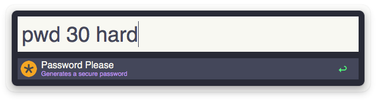

Password, Please! for Alfred
============================

> [Password, Please!](https://github.com/florianeckerstorfer/passwordplease-php) is a workflow for Alfred that generates password of a given length and complexity.

Installation
------------

Download the latest [release](https://github.com/florianeckerstorfer/passwordplease-alfred/releases) and double-click the `passwordplease.alfredworkflow` file.

Usage
-----

The default keyword for **Password, Please!** is `pwd`. You can add two optional arguments, length and complexity. Length must be the first argument, complexity the second. Length must be a number larger than `0`. Complexity can be either a number between 1 (very high complexity) and 4 (low complexity) or one of the aliases listed in the table below.

<table>
    <thead>
        <tr>
            <th>Level</th>
            <th>Alias</th>
            <th>Characters</th>
        </tr>
    </thead>
    <tbody>
        <tr>
            <td><code>1</code></td>
            <td><code>veryhigh</code>, <code>harder</code></td>
            <td><code>a-zA-Z0-9,;.:-_+*#!()=?%&@$"'</code></td>
        </tr>
        <tr>
            <td><code>2</code></td>
            <td><code>high</code>, <code>hard</code></td>
            <td><code>a-zA-Z0-9</code></td>
        </tr>
        <tr>
            <td><code>3</code></td>
            <td><code>medium</code>, <code>normal</code></td>
            <td><code>a-zA-Z</code></td>
        </tr>
        <tr>
            <td><code>4</code></td>
            <td><code>low</code>, <code>easy</code></td>
            <td><code>a-z</code></td>
        </tr>
    </tbody>
</table>

Change Log
----------

### Version 0.2 (4 October 2014)

- Initial release

Author
------

Developed by [Florian Eckerstorfer](https://florian.ec) in Vienna, Europe.

License
-------

The MIT license applies to `florianeckerstorfer/passwordplease-alfred`. For the full copyright and license information, please view the `LICENSE` file distributed with this source code.

